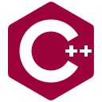

  

  <!-- LANGUAGE related -->
  <!-- C/C++ related -->
  &nbsp;
  &nbsp;
  &nbsp;
  <!-- Java related -->
  &nbsp;
  &nbsp;
  &nbsp;
  <!-- JS related -->
  &nbsp;
  &nbsp;
  &nbsp;
  &nbsp;
  &nbsp;
  <!-- Shell related -->
  &nbsp;

  <!-- Web cloud services related -->
  &nbsp;
  &nbsp;
  &nbsp;
  <!-- API related -->
  &nbsp;
  <!-- Db related -->
  &nbsp;
  &nbsp;
  &nbsp;
  <!-- Containers related -->
  &nbsp;
  &nbsp;

  <!-- Material design related -->
  &nbsp;
  &nbsp;

  &nbsp;

  &nbsp;

